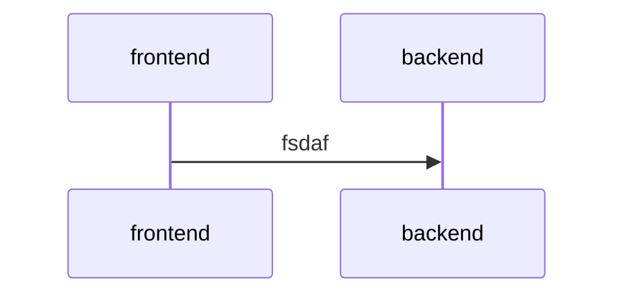

# RYAMA's FlowChart

## サイトの流れ

# Markdowns Page

refrence: https://stackedit.io/app#

## どのようにMarkdownパージを表示するか

### Explorer

#### Click of Folder
クリックしたら[**LocalStorage**](https://www.youtube.com/watch?v=uuAdVs7sbAs)に**openFolders**のキーに、  
**list** で保存して、それで**FolderItem** に**open-folder** みたいな**className** を追加しよう。  
(これで仮にページをリロードしたりしても保存しておける)
### Click of File
クリックしたら **/markdonws/${file.id}** としてそこにurlをチェンジする,  
そしてファイルの**className** に **active-file** を付与して選択してるよ、というのを見えるようにする。  
ここでもしかりに、そのファイルがない場合、他人のファイルの場合は **/markdonws** に戻るようにしよう。  

これらがuser tokenだったりreactでのlogin,logoutだったりのUser関係の参考記事,  
(多分ここさえできてしまえば、あとはreactをちょっと勉強するだけだからだいぶ、ラストスパート)  
https://note.crohaco.net/2018/django-rest-framework-view/  
https://qiita.com/okoppe8/items/c58bb3faaf26c9e2f27f  
https://qiita.com/shun198/items/268f6e98dbc11fac1831  
https://qiita.com/shun198/items/067e122bb291fed2c839  
https://qiita.com/tomoyukiy/items/a282b2c97ae2bbedac33  
https://qiita.com/Bashi50/items/8964cc55c596e51fcbbe  

---

