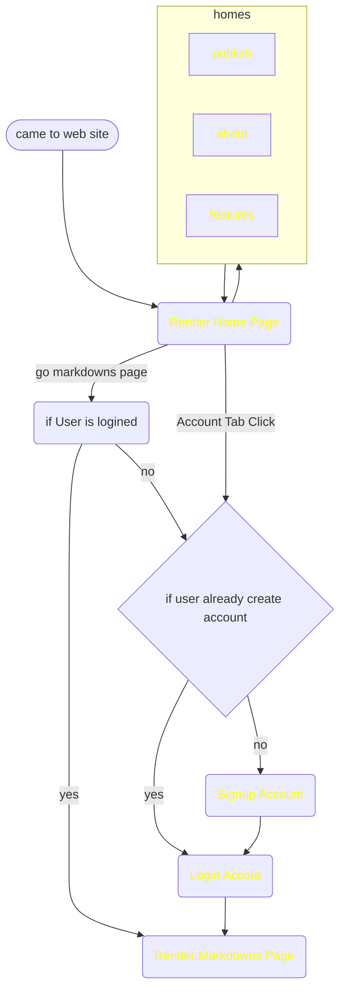
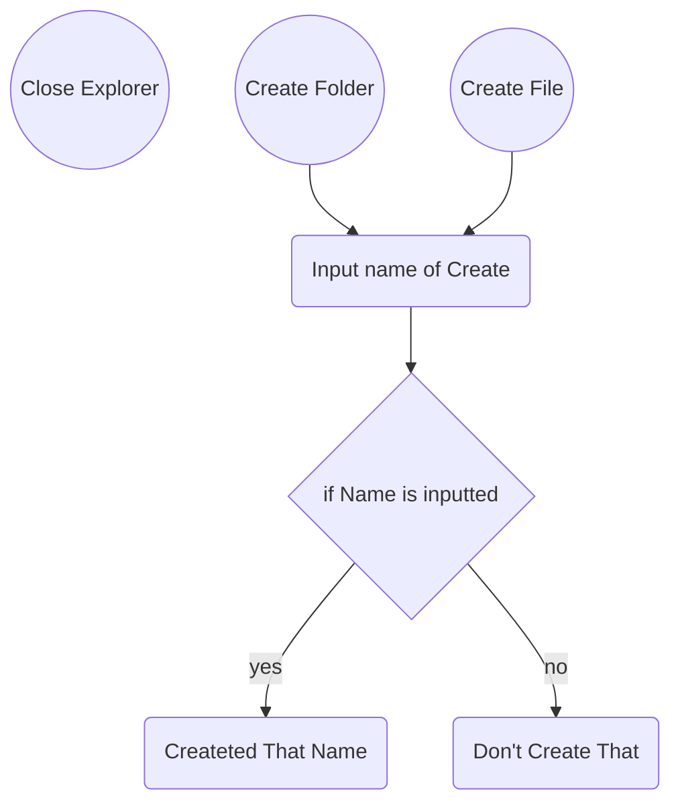
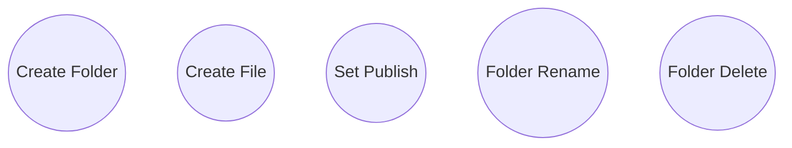
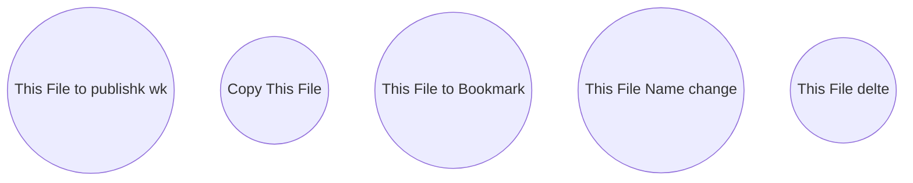
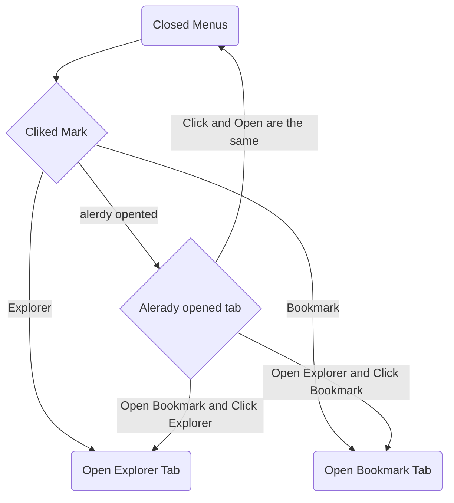

# RYAMA's FlowChart

## サイトの流れ

```mermaid
flowchart TD;

BOF([came to web site]) --> redirect_home(Render Home Page)

redirect_home --> homes
homes --> redirect_home
subgraph homes
    publish
    about
    features
end

redirect_home --> |go markdowns page| if_is_logined(if User is logined)
redirect_home --> |Account Tab Click| if_has_account
if_is_logined --> |yes| page_markdowns(Render Markdowns Page)
if_is_logined --> |no| if_has_account{if user already create account}
if_has_account --> |yes| action_login(Login Accout)
if_has_account --> |no| action_signup(Signup Account)
action_signup --> action_login
action_login --> page_markdowns

%% yellow は 一つのpageです
style publish color:yellow
style about color:yellow
style features color:yellow
style redirect_home color:yellow
style action_login color:yellow
style action_signup color:yellow
style page_markdowns color:yellow
```

# Markdowns Page

## SideBard Action

### Cliked Empty

```mermaid
flowchart TD;

close_explorer((Close Explorer))
create_folder((Create Folder)) & create_file((Create File)) --> input_name(Input name of Create)
input_name --> if_inputted{if Name is inputted}
if_inputted --> |yes| create_success(Createted That Name)
if_inputted --> |no| not_create(Don't Create That)
```

---

### Cliked Folder

```mermaid
flowchart TD;

create_folder((Create Folder))
create_file((Create File))
publish((Set Publish))
rename((Folder Rename))
delte((Folder Delete))
```

---

### Cliked File

```mermaid
flowchart TD;

publish((This File to publishk wk))
copy((Copy This File))
bookmark((This File to Bookmark))
rename((This File Name change))
delte((This File delte))
```

## Design

```mermaid
flowchart TD;
close(Closed Menus)
close --> clicked_mark{Cliked Mark}
clicked_mark --> |Explorer| open_explorer(Open Explorer Tab)
clicked_mark --> |Bookmark| open_bookmark(Open Bookmark Tab)
clicked_mark --> |alerdy opented| opend_tab{Alerady opened tab}
opend_tab --> |Open Explorer and Click Bookmark| open_bookmark
opend_tab --> |Open Bookmark and Click Explorer| open_explorer
opend_tab --> |Click and Open are the same| close
```
